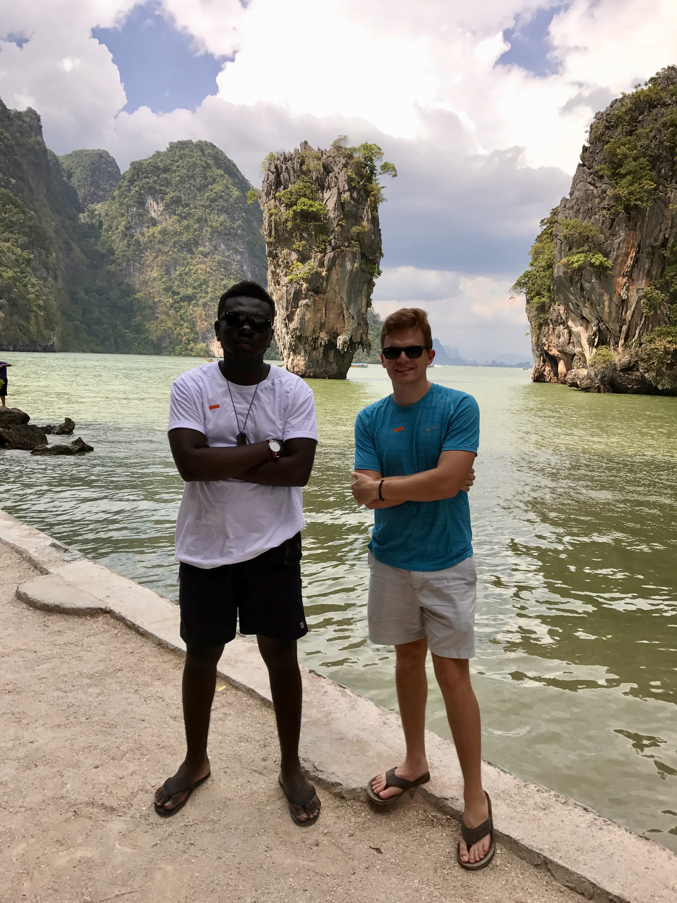
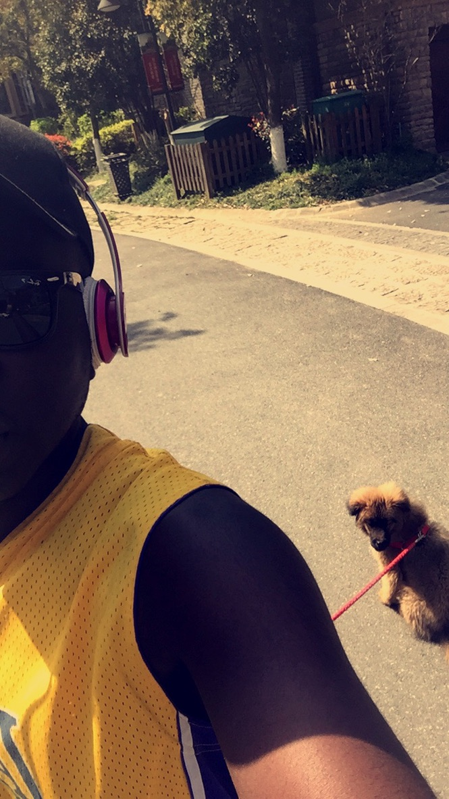
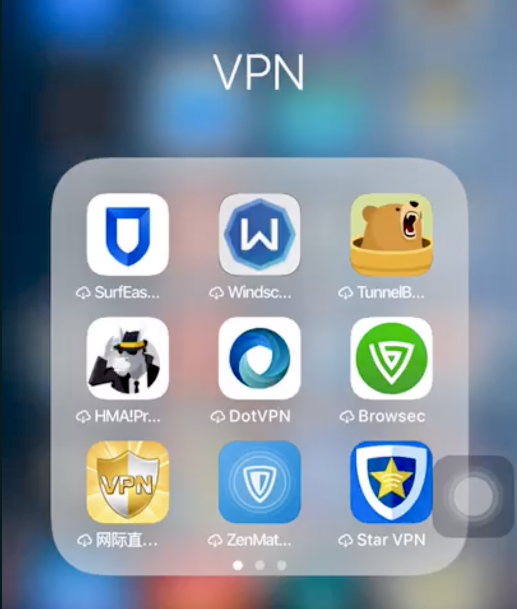

I've been contemplating and having several ideas on what to do with the thoughts in my head and all i do. My mentors and friends have been telling me to make content for social media for sometime now but i've pushed back not because the idea itself is bad but as someone who prefers to have a personal life,  i know how blurred the lines could be between content making and personal life.

For the longest time my work and life have been intertwined. Knowing how social media is designed and engineered to take up all our attention and time I've been cautious. Years back i bought my first camera and decided to travel the world to take pictures and document the things i saw. I made posts on my personal instagram and later created a travel page, however i caught myself not living in the moment and taking pictures and videos for the internet. 

The turning point; Winter Vacation 2017

The nice thing about living in China is that is that when it gets cold in winter you can take a short cheap trip to places like Thailand, Indonesia, Singapore, Malaysia. I spent my winter holiday in Thailand where my trip was split between Bangkok and Phuket Island. I was a solo traveler as usual and i ended up on a mini van with another solo traveler Steve and American college grad. We tagged along since we were the only solo travelers in our group to Phi Phi Island. After our day trip Steve and I decided to hangout. We dropped by my hotel for me to change and drop my stuff before going to his hostel which was i the hotzone. When we got to the hotel he questioned why i was spending that much money on a hotel as a young solo traveler and also having so much clothes and shoes. I explained to him that i needed different clothes for each day and also needed to take nice pictures for my socials. He laughed and said i didn't need to do all that. He explained that on a trip i needed only one good half body picture of me at a landmark if i wanted to prove to the "world" that i had been to a place. The rest of the pictures could be of the places and also personal pictures for myself. He also explained how i could save money and also meet other young people and staying at hostels and in prime areas in any place. His logic was simple you're traveling to explore not taking pictures of the hotel and pool for your friends. When we got to his hostel and i started a random convo with a young guest whiles waiting for him at the lobby i understood what he was saying. I cared so much about proving to people where i was living and what i was doing. He later explained over dinner that i could also pack less and buy clothes from the countries i traveled to. He had more travel experience than i did and i did my own research and found the truth in his observation. This changed my travel life but also my Social Media life.  

I used to update my instagram stories with pictures and videos of my morning walk with Nani my first dog. That's all i cared to shared until one day a friend who lived in Accra, Ghana which is over 7,000 miles from Hangzhou, China where i was living sent me a DM asking me me why all i did was be with my dog and recommended i go out to have fun and enjoy life. 

I was stunned. How could this guy possibly tell me how to live my life? How do you know what i'm doing? What made me upset was how my day had actually went. I woke up late and took Nani for a walk in the neigborhood and posted on my story. After i took him back home i took my shower left home and met up with my friend Chinese friend Allen and his gf at the time Claire at Reading Tree one of our usual hangout Coffee Shops downtown. We hang out for a while, had branch and later move to Chen Coffee; owned by Allens family friend. We hang out there until i left for my date with a friend to the movies late afternoon. After the movie we had dinner, went window shopping and left to to go home because of Nani. I got him took Nani out and as usual shared a video of our walks in the neighborhood on Instagram. So imagine my shock and anger when i got the text. I was visibly upset. How how how i kept asking myself. I had an awesome day. What right does this friend have to tell me how to live my life. I however stopped myself from being upset and laughed. He was my friend so i just sent him a VN when i got back to my apartment telling him about my day and we laughed about it.

Updating my Instagram meant turning on my many VPNs to see which one would work. VPNs in  China also worked well better over WIFI than cellular.  I wasn't living my life for social media. I only cared to show what i wanted people to see which was my dog and nature stuff. Social Media distorts reality. Imaging forming an opinion on who i am based on what i post. Can i be mad? Probably not. I show the "world" that and i can't blame anyone. I then remembered when i first heard the quote "Never Meet Your Idols". Everything i know about my favorite celebrities; actors , musicians etc is as script.I  don't actually know these people and i shouldn't model my life around them.

That made me question so much. If he thinks like this how many people think like that? The issue wasn't him. It was how social media had conditioned people to think.  My mom called me one time worried about what her friend told her about me. Her friends son had seen my post of a posted told his mom who ended up telling my mom that i was living life and spending money.The problem was this was a business trip and the picture was nothing but a picture of the skyline in Shanghai. My mom didn't want the attention and asked me to please be careful with my posts.

Fast forward years later and i was stuck in Ghana during covid and my own cousin asked me if i actually ever went to school in China. I was like WTF????? His supporting statement to back that question was that well we never saw your school pictures, again pointing to Instagram. I couldn't believe what i was hearing. This is my cousin who has known me since i was baby. Why not just ask me about college instead of questioning me based on INSTAGRAM. I was upset but kept that inside me and smiled. Years later when i moved to Chicago for school i made a promise to myself to not upload any pictures on IG until after my graduation which i did i after 2 years. 

That same cousin who lives in NY was upset i didn't tell him about my graduation. That was me being petty. I told him pointblank i did that because of what he asked me years ago prior to me coming to grad school. Social Media is not real life. 

Why did i decide to start blogging again in 2026? Well because i have matured and lived life enough to know that i have a lot to share. However this time around i recognize that my need to write is a selfish decision for myself to find an outlet to let my thoughts and experiences out. I was talking to my "twin" my person i share a birthday who is also a writer and we had the same internal battles but also realized how much we need to do this for ourselves and not the pressure of seeking validation but rather our need to write. Harper helped me set up my micro blog account sometime last year but i finally decided to rebuild it with claude. This is me keeping myself accountable and doing what i want with no pressure.

Content creation is relevant in today's world in many ways that didn't exist years ago nobody can deny it. The question however is at what point do you separate content from your personal or business/work life?

I read a lot and i believe in documenting through text and photo journaling. I don't want to be pressured or controlled by an algorithm which is why i choose to write here instead of a monetized platform and for likes and comments.

I have a lot written in my notes over the years and i'll do my best to share the current as well as the past and future.
